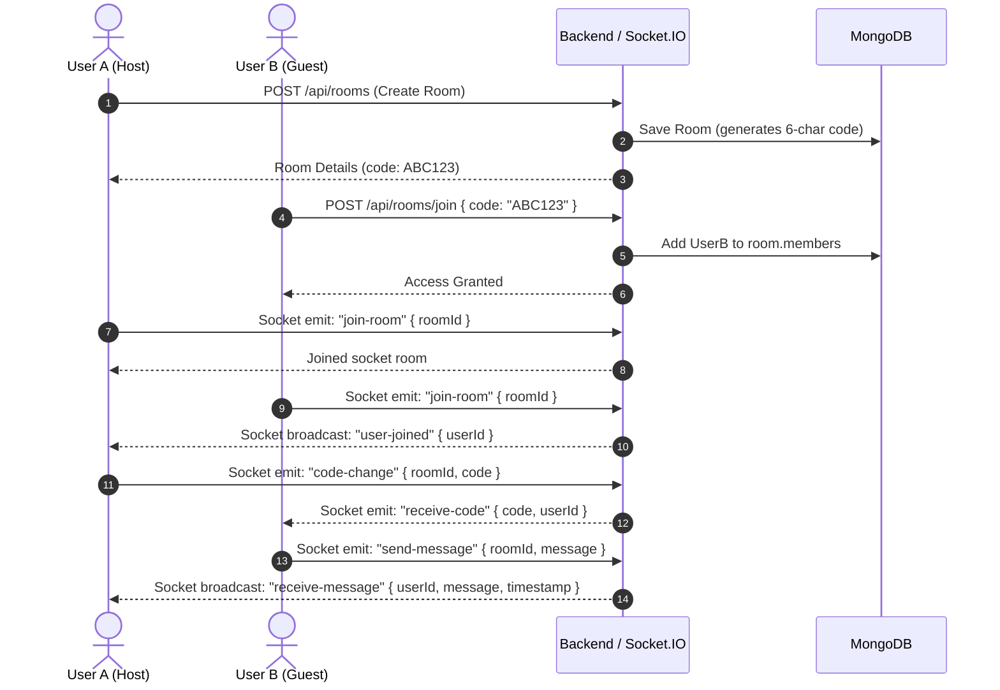

# LEARN EASY — System Architecture & Codebase Map

> **Purpose:** This document is the technical architecture blueprint for the LEARN EASY platform. It explains the system design, directory layout, request lifecycles, and data flows so any developer or AI assistant can understand the codebase without manual exploration.

---

## 1. System Overview

LEARN EASY is a full-stack student productivity and collaborative study platform. It integrates:
- **Personal Task & Session Management**: Task creation, filtering, status toggling, and Pomodoro/study session tracking.
- **Collaborative Study Rooms**: Real-time multi-user rooms identified by 6-character room codes.
- **Live Collaborative Code Editor**: Synchronized Python code editor with live syntax updates across participants.
- **In-Room Chat**: Real-time group messaging within active rooms.
- **Code Execution Runner**: Backend execution endpoint for running Python code.
- **Study Resources Library**: Local resource bookmarking and tag-based search.

```mermaid
graph TD
    subgraph Client ["Frontend (React 19 + Vite + Tailwind)"]
        UI[Pages & Components]
        AuthCtx[AuthContext / localStorage]
        AxiosInst[Axios Client (src/services/api.js)]
        SocketClient[Socket.IO Client (src/services/socket.js)]
    end

    subgraph Backend ["Backend (Node.js + Express 5)"]
        App[Express App (app.js)]
        AuthMW[Auth Middleware (JWT Verify)]
        Routers[Express Routers: Auth, Tasks, Rooms, Sessions, Code]
        SocketMgr[Socket Manager (socket/socketManager.js)]
    end

    subgraph Data ["Database & System"]
        Mongo[(MongoDB Atlas)]
        Exec[Child Process (Python3 Runner)]
    end

    UI --> AuthCtx
    UI --> AxiosInst
    UI --> SocketClient

    AxiosInst -->|HTTP + Bearer Token| App
    SocketClient -->|WebSocket + Auth Handshake| SocketMgr

    App --> AuthMW --> Routers
    Routers --> Mongo
    Routers -->|/api/code/run| Exec
    SocketMgr --> Mongo
```

---

## 2. Technology Stack

| Layer | Technology | Key Libraries & Tools |
| :--- | :--- | :--- |
| **Frontend** | React 19, JavaScript (ESM) | Vite 7, React Router 7, TailwindCSS 3, Axios, Socket.IO Client, Lottie-React, Lucide Icons |
| **Backend** | Node.js (ESM), Express 5 | Mongoose 9, Socket.IO 4, JSONWebToken (JWT), BcryptJS, Dotenv, Cors |
| **Database** | MongoDB Atlas (or local) | Mongoose ODM with schemas for User, Task, Room, Session |
| **Real-time** | WebSockets | Socket.IO with JWT handshake authentication |

---

## 3. Directory Layout & File Map

### 3.1 Frontend (`/` and `src/`)

```
.
├── index.html                   # HTML entry point with Google Fonts
├── vite.config.js               # Vite configuration (React plugin)
├── tailwind.config.js           # Tailwind CSS theme and color tokens
├── postcss.config.js            # PostCSS Autoprefixer and Tailwind
├── package.json                 # Frontend scripts and dependencies
└── src/
    ├── main.jsx                 # React root mount, renders <App /> inside <AuthProvider>
    ├── App.jsx                  # React Router definitions (public, protected, and room routes)
    ├── index.css                # Tailwind directives and global styling
    │
    ├── context/
    │   └── AuthContext.jsx      # Global authentication provider (user, token, login, logout, register)
    │
    ├── services/
    │   ├── api.js               # Axios instance with auth request/response interceptors
    │   └── socket.js            # Socket.IO client singleton with connect/disconnect methods
    │
    ├── api/                     # Domain-specific API callers (wraps services/api.js)
    │   ├── authApi.js           # login, register
    │   ├── taskApi.js           # fetchTasks, createTask, updateTask, deleteTask, getTaskStats
    │   ├── roomApi.js           # createRoom, joinRoom, getRoomDetails, deleteRoom, leaveRoom
    │   ├── sessionApi.js        # startSession, endSession, getSessions
    │   └── codeApi.js           # runCode (POST /api/code/run)
    │
    ├── layouts/
    │   ├── LandingLayout.jsx    # Public wrapper (Navbar + Outlet for Landing, Login, Register)
    │   └── AppLayout.jsx        # Protected dashboard wrapper (TopNavbar + Sidebar + Main content)
    │
    ├── pages/
    │   ├── Landing.jsx          # Public marketing page with feature previews
    │   ├── Login.jsx            # Sign-in form
    │   ├── Register.jsx         # Sign-up form
    │   ├── Dashboard.jsx        # Overview: recent tasks, quick room join, study stats
    │   ├── Productivity.jsx     # Full task manager (CRUD, filters, priority grouping)
    │   ├── Focus.jsx            # Distraction-free Pomodoro study timer with session logging
    │   ├── Collaboration.jsx    # Room lobby (create room, join room by 6-char code)
    │   ├── Room.jsx             # Active study room (shared editor, live chat, participant list)
    │   ├── Resources.jsx        # Resource bookmarks library (localStorage-based)
    │   ├── Settings.jsx         # User profile and UI preference settings
    │   └── Help.jsx             # FAQ and platform documentation guide
    │
    ├── components/              # Reusable UI elements
    │   ├── ProtectedRoute.jsx   # Route guard (redirects unauthenticated users to /login)
    │   ├── Navbar.jsx           # Public landing page navigation bar
    │   ├── TopNavbar.jsx        # Dashboard top header with user profile menu
    │   ├── Button.jsx, Input.jsx, Modal.jsx, Card.jsx, Badge.jsx  # Base UI design system
    │   └── ...                  # TaskGroup, ProductivityAnalytics, SessionTimeline, etc.
    │
    └── utils/
        └── auth.js              # Token helpers: getStoredToken, setStoredAuth, isTokenExpired
```

### 3.2 Backend (`backend/`)

```
backend/
├── package.json                 # Backend scripts ("dev": "nodemon server.js")
├── server.js                    # Server entry: connects DB, attaches Socket.IO, starts HTTP server
├── app.js                       # Express app: mounts CORS, express.json, and route handlers
├── .env                         # Environment variables (PORT, MONGO_URI, JWT_SECRET)
│
├── config/
│   └── db.js                    # Mongoose database connection configuration
│
├── models/                      # Mongoose Database Schemas
│   ├── User.js                  # User model (name, email, hashed password via bcrypt)
│   ├── Task.js                  # Task model (user ref, title, priority, category, dueDate, status)
│   ├── Room.js                  # Room model (name, code [6-chars], creator ref, members array)
│   └── Session.js               # Study session model (user ref, task ref, startTime, endTime, duration)
│
├── middleware/
│   └── authMiddleware.js        # Validates Bearer JWT header and populates req.user
├── middlewares/
│   └── errorMiddleware.js       # Central Express error handling middleware
│
├── controllers/                 # Route business logic
│   ├── authController.js        # registerUser, loginUser (issues 1-day JWT)
│   ├── taskController.js        # createTask, getTasks, updateTask, deleteTask, getTaskStats
│   ├── roomController.js        # createRoom, joinRoom, getRoomDetails, leaveRoom, deleteRoom
│   ├── sessionController.js     # startSession, endSession, getSessions
│   └── codeController.js        # runCode (writes temp .py file, executes python3, cleans up)
│
├── routes/                      # Express route endpoints
│   ├── authRoutes.js            # /api/auth
│   ├── taskRoutes.js            # /api/tasks (protected)
│   ├── roomRoutes.js            # /api/rooms (protected)
│   ├── sessionRoutes.js         # /api/sessions (protected)
│   ├── codeRoutes.js            # /api/code
│   └── testRoutes.js            # Health check: GET / -> "API is running"
│
└── socket/
    └── socketManager.js         # Socket.IO connection handling, JWT auth handshake, room events
```

---

## 4. Authentication Flow

1. **Sign Up / Sign In**: Client sends credentials to `/api/auth/register` or `/api/auth/login`.
2. **Password Hashing**: Backend hashes passwords with `bcryptjs` (salt rounds: 10).
3. **JWT Generation**: On successful login, backend signs a token with `process.env.JWT_SECRET` (valid for 1 day) containing `{ id: user._id }`.
4. **Client Storage**: Token and user details are saved in `localStorage` under keys `token` and `user`.
5. **API Calls**: Axios request interceptor attaches header: `Authorization: Bearer <token>`.
6. **Socket Connection**: Socket.IO connects passing `auth: { token: <token> }`. The backend verifies the token in `io.use()` handshake before allowing the socket connection.

---

## 5. Real-Time Collaboration Lifecycle (Rooms)



---

## 6. Development Workflow

- **Start Frontend**: `npm run dev` (Vite, default `http://localhost:5173`)
- **Start Backend**: `cd backend && npm run dev` (Nodemon, default `http://localhost:8000`)
- **Run Frontend Linter**: `npm run lint`
- **Build Frontend**: `npm run build` (Outputs to `dist/`)
