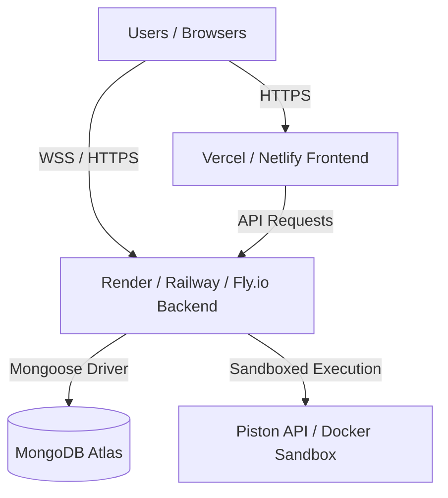

# LEARN EASY — Production Readiness & Improvement Roadmap

> **Audit Date:** September 2026  
> **Target Status:** Pre-Production Audit  
> **Deployment Verdict:** ⚠️ **DO NOT DEPLOY IN CURRENT STATE** (Critical security vulnerabilities and hardcoded environment blockers must be resolved first).

---

## Table of Contents
1. [Executive Summary](#executive-summary)
2. [Priority 1: Critical Deployment Blockers (Must-Fix Before Launch)](#priority-1-critical-deployment-blockers)
3. [Priority 2: Critical Security Vulnerabilities](#priority-2-critical-security-vulnerabilities)
4. [Priority 3: Architecture & Codebase Cleanup](#priority-3-architecture--codebase-cleanup)
5. [Priority 4: Frontend Performance & UX Improvements](#priority-4-frontend-performance--ux-improvements)
6. [Priority 5: Feature Enhancements & Data Persistence](#priority-5-feature-enhancements--data-persistence)
7. [Production Deployment Blueprint & Environment Configuration](#production-deployment-blueprint)
8. [Step-by-Step Action Checklist](#step-by-step-action-checklist)

---

## Executive Summary

The **LEARN EASY** application has a strong functional foundation, including authentication, task management, collaborative rooms, real-time code synchronization via Socket.IO, and chat.

However, an audit of the codebase reveals **severe security risks (unauthenticated Remote Code Execution on the host machine)** and **hardcoded environment settings (`localhost` URLs and CORS)** that will cause the application to fail immediately when deployed to cloud providers.

This document provides a prioritized roadmap and concrete code solutions to make the platform production-ready, secure, and maintainable.

---

## Priority 1: Critical Deployment Blockers

These issues will immediately break the application in production if not changed.

### 1.1 Hardcoded `localhost:8000` in Frontend API & WebSockets
* **Affected Files:**
  - `src/services/api.js` (Line 25)
  - `src/services/socket.js` (Line 5)
* **Problem:**  
  When deployed to a host like Vercel or Netlify, end-users' browsers will attempt to make HTTP and WebSocket requests to `http://localhost:8000` (their own local machine) instead of your deployed backend server.
* **Remediation:**  
  Use Vite environment variables with a fallback for local development.

```javascript
// src/services/api.js
const API_BASE_URL = import.meta.env.VITE_API_URL || "http://localhost:8000";

export const api = axios.create({
  baseURL: API_BASE_URL,
  withCredentials: true,
  headers: {
    "Content-Type": "application/json",
  },
});
```

```javascript
// src/services/socket.js
const SOCKET_URL = import.meta.env.VITE_SOCKET_URL || import.meta.env.VITE_API_URL || "http://localhost:8000";

export const socket = io(SOCKET_URL, {
  autoConnect: false,
});
```

---

### 1.2 Hardcoded CORS Origin in Backend
* **Affected Files:**
  - `backend/app.js` (Lines 14–18)
  - `backend/server.js` (Lines 21–26)
* **Problem:**  
  Both Express and Socket.IO only allow requests originating from `http://localhost:5173`. Any production frontend domain (e.g. `https://learn-easy.vercel.app`) will be blocked by CORS.
* **Remediation:**  
  Allow dynamic origins configured via environment variables, supporting both local dev and production.

```javascript
// backend/app.js & backend/server.js
const allowedOrigins = [
  process.env.CLIENT_URL,
  'http://localhost:5173',
  'http://localhost:3000'
].filter(Boolean);

const corsOptions = {
  origin: (origin, callback) => {
    // allow requests with no origin (like mobile apps or curl)
    if (!origin || allowedOrigins.includes(origin)) {
      return callback(null, true);
    }
    return callback(new Error('Blocked by CORS'));
  },
  credentials: true,
};

app.use(cors(corsOptions));

// Socket.io config in server.js
const io = new Server(server, {
  cors: corsOptions,
});
```

---

### 1.3 Insecure MongoDB TLS Flag
* **Affected File:**
  - `backend/config/db.js` (Line 6)
* **Problem:**  
  `tlsAllowInvalidCertificates: true` disables TLS/SSL certificate validation when connecting to MongoDB Atlas. In production, this exposes database traffic and credentials to Man-in-the-Middle (MITM) attacks.
* **Remediation:**  
  Remove `tlsAllowInvalidCertificates: true` in production environments, keeping it only for strict offline local debugging if needed.

```javascript
// backend/config/db.js
const connectDB = async () => {
  try {
    const options = process.env.NODE_ENV === 'production' 
      ? {} 
      : { tlsAllowInvalidCertificates: process.env.ALLOW_INVALID_CERTS === 'true' };

    await mongoose.connect(process.env.MONGO_URI, options);
    console.log('MongoDB connected');
  } catch (error) {
    console.error(`MongoDB connection failed: ${error.message}`);
    process.exit(1);
  }
};
```

---

## Priority 2: Critical Security Vulnerabilities

### 2.1 🚨 CRITICAL: Unauthenticated Remote Code Execution (RCE)
* **Affected File:**
  - `backend/controllers/codeController.js` (Lines 11–30)
* **The Vulnerability:**  
  The endpoint `/api/code/run` executes arbitrary Python code submitted in the HTTP POST body directly on the server's host OS via Node's `child_process.exec`:
  ```javascript
  exec(`python3 "${filePath}"`, { timeout: 5000 }, ...)
  ```
  **Risks:**
  1. **No Authentication:** Anyone with the API URL can hit this endpoint.
  2. **No Sandboxing:** An attacker can execute commands such as:
     - `import os; print(os.environ)` → dumps `MONGO_URI`, `JWT_SECRET`, database passwords.
     - `import os; os.system("rm -rf /")` → wipes out server data.
     - Spawning reverse shells or crypto miners on your server host.
* **Recommended Solution for Production:**
  1. **Short-term / Safe Option:** Integrate with a managed sandboxed code execution API such as **[Piston](https://github.com/engineer-man/piston)** or **[Judge0](https://judge0.com)** rather than executing arbitrary user code on your application server.
  2. **Self-Hosted Option:** Run code execution in an isolated, ephemeral Docker container (e.g., using Docker SDK with `--network none`, non-root user, memory limit, and read-only rootfs) or inside gVisor/firecracker microVMs.
  3. **Access Control:** Require authentication (`authMiddleware`) on `/api/code/run` and enforce strict per-user rate limits.

---

### 2.2 Rate Limiting & Brute-Force Protection
* **Affected Areas:**
  - `/api/auth/login`
  - `/api/auth/register`
  - `/api/code/run`
* **Problem:**  
  Currently, there is no limit on how many requests a client can make, leaving the app vulnerable to credential stuffing and DoS attacks.
* **Remediation:**  
  Install `express-rate-limit` and apply it to sensitive routes:
  ```bash
  cd backend && npm install express-rate-limit
  ```
  ```javascript
  import rateLimit from 'express-rate-limit';

  export const authLimiter = rateLimit({
    windowMs: 15 * 60 * 1000, // 15 minutes
    max: 10, // 10 attempts per IP
    message: { message: 'Too many attempts. Please try again in 15 minutes.' },
  });

  export const codeExecutionLimiter = rateLimit({
    windowMs: 60 * 1000, // 1 minute
    max: 12, // max 12 runs per minute per IP
    message: { error: 'Execution limit exceeded. Please wait a moment.' },
  });
  ```

---

### 2.3 HTTP Security Headers (`helmet`)
* **Problem:**  
  Missing standard security headers (Content Security Policy, X-Frame-Options, X-Content-Type-Options, etc.).
* **Remediation:**  
  ```bash
  cd backend && npm install helmet
  ```
  ```javascript
  // backend/app.js
  import helmet from 'helmet';
  app.use(helmet());
  ```

---

## Priority 3: Architecture & Codebase Cleanup

### 3.1 Consolidate Duplicate Middleware & Socket Folders
* **Issue:**  
  - Two middleware folders exist: `backend/middleware/` (contains `authMiddleware.js`) and `backend/middlewares/` (contains `errorMiddleware.js`).
  - Two socket folders exist: `backend/socket/` (active) and `backend/sockets/` (empty).
* **Fix:**  
  Consolidate into `backend/middleware/` and remove empty or redundant directories to prevent developer confusion and broken imports.

### 3.2 Remove Development / Scratch Files
* **Issue:**  
  `backend/todo.json` is committed in the backend root with mock data.
* **Fix:**  
  Delete `backend/todo.json` or add `*.json` test mocks to `.gitignore` / `backend/test/fixtures/`.

### 3.3 Centralized Environment Variable Validation
* **Problem:**  
  If `JWT_SECRET` or `MONGO_URI` is missing or undefined at startup, the server can crash silently or issue tokens with `undefined` secret.
* **Remediation:**  
  Add startup validation:
  ```javascript
  // backend/config/validateEnv.js
  const requiredEnvs = ['MONGO_URI', 'JWT_SECRET', 'PORT'];

  export const validateEnv = () => {
    const missing = requiredEnvs.filter((key) => !process.env[key]);
    if (missing.length > 0) {
      console.error(`FATAL: Missing required environment variables: ${missing.join(', ')}`);
      process.exit(1);
    }
  };
  ```

### 3.4 Request Validation with Schemas (Zod or Joi)
* **Problem:**  
  Controllers currently do manual string checks and regex matching (`isValidEmail`, `!name`, etc.).
* **Remediation:**  
  Use `zod` schema validation middleware to standardize request body verification across all endpoints and prevent invalid payloads from reaching controllers.

---

## Priority 4: Frontend Performance & UX Improvements

### 4.1 Bundle Splitting & Lazy Loading
* **Issue:**  
  Vite build indicates that the production JavaScript bundle exceeds 1MB (`dist/assets/index-CKG5t2NS.js: 1,063 kB`).
* **Fix:**  
  Use dynamic imports (`React.lazy` and `Suspense`) in `src/App.jsx` for heavy views (such as the Collaboration Room, Code Editor, and Task Dashboard):
  ```javascript
  const Room = React.lazy(() => import('./pages/Room'));
  const Tasks = React.lazy(() => import('./pages/Tasks'));
  const Resources = React.lazy(() => import('./pages/Resources'));
  ```

### 4.2 Lottie Player Eval Warning
* **Issue:**  
  `lottie-web` issues a warning during build: *"Use of eval in lottie-web is strongly discouraged as it poses security risks and may cause issues with minification."*
* **Fix:**  
  Switch to `lottie-web/build/player/lottie_light.js` (or configure `@lottie-react` to use the SVG canvas renderer without expressions) to eliminate eval and reduce bundle size.

### 4.3 Network Reconnection UI Feedback
* **Issue:**  
  When internet connection is interrupted, Socket.IO disconnects silently without an obvious UI indicator to room members.
* **Fix:**  
  Add an active connection status pill (🟢 Connected / 🟡 Reconnecting / 🔴 Offline) in the TopNavbar or Room header to prevent confusion if synchronization pauses.

---

## Priority 5: Feature Enhancements & Data Persistence

### 5.1 Study Resources Persistence (MongoDB Integration)
* **Current State:**  
  The Study Resources library currently only saves items to the browser's `localStorage` (`src/pages/Resources.jsx`). Users lose their resources if they switch browsers or devices.
* **Enhancement:**  
  1. Create a `Resource` Mongoose model (`title`, `url`, `type`, `tags`, `userId`).
  2. Implement `/api/resources` CRUD endpoints with `authMiddleware`.
  3. Update frontend to fetch and synchronize resources with the backend.

### 5.2 Room History & Chat Logging
* **Current State:**  
  When a user joins or refreshes the room, previous chat messages are lost.
* **Enhancement:**  
  Optionally store the last 50 chat messages in the `Room` document in MongoDB so late-joining participants can see recent discussions.

---

## Production Deployment Blueprint

### Recommended Architecture



* **Frontend Hosting:** Vercel, Netlify, or Cloudflare Pages
* **Backend Hosting:** Render, Railway, Fly.io, or DigitalOcean App Platform (must support persistent WebSocket connections for Socket.IO)
* **Database:** MongoDB Atlas (M0/M10 Cluster)

---

### Environment Variables Template

#### Frontend (`.env.production`)
```ini
VITE_API_URL=https://your-backend-service.onrender.com
VITE_SOCKET_URL=https://your-backend-service.onrender.com
```

#### Backend (`.env.production`)
```ini
NODE_ENV=production
PORT=8000
MONGO_URI=mongodb+srv://<username>:<password>@cluster0.xxxx.mongodb.net/production?retryWrites=true&w=majority
JWT_SECRET=your_super_secret_64_character_random_hex_key
CLIENT_URL=https://your-frontend.vercel.app
```

---

## Step-by-Step Action Checklist

- [x] **Step 1: Fix Frontend Endpoints**  
  Updated `src/services/api.js` and `src/services/socket.js` to use `import.meta.env.VITE_API_URL`.
- [x] **Step 2: Dynamic CORS in Backend**  
  Updated `backend/app.js` and `backend/server.js` to accept `CLIENT_URL` from environment variables.
- [x] **Step 3: Secure MongoDB Connection**  
  Removed `tlsAllowInvalidCertificates` from production in `backend/config/db.js`.
- [x] **Step 4: Secure `/api/code/run`**  
  Added `authMiddleware`, `codeExecutionLimiter`, Zod validation, and Piston sandbox execution.
- [x] **Step 5: Add Security Middlewares**  
  Installed and configured `helmet` and `express-rate-limit`.
- [x] **Step 6: Consolidate Folders**  
  Merged `backend/middlewares` into `backend/middleware`, deleted `backend/sockets/` and `backend/todo.json`.
- [x] **Step 7: Code Splitting**  
  Added `React.lazy` for all routes in `src/App.jsx`.
- [x] **Step 8: Startup Env Validation**  
  Created `backend/config/validateEnv.js` — server fails fast if `MONGO_URI`, `JWT_SECRET`, or `PORT` are missing.
- [x] **Step 9: Chat History Persistence**  
  Room model now stores last 50 messages; joining users receive history via `chat-history` socket event.
- [x] **Step 10: Study Resources Backend Persistence**  
  Mongoose `Resource` model, `/api/resources` CRUD endpoints, and `Resources.jsx` updated to use backend API.
- [ ] **Step 11: Deploy & Test**  
  Deploy backend to Render/Railway, deploy frontend to Vercel, and verify WebSocket rooms and task creation under production URLs.
